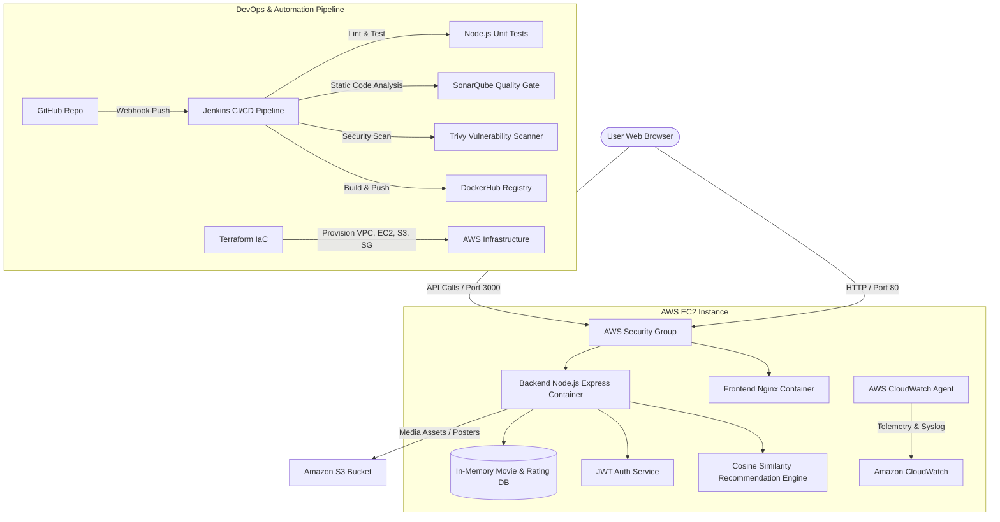

# CineMatch Architecture & Technical Specification

## System Overview
CineMatch is a microservices-based Movie Recommendation System built with a complete DevOps lifecycle. The system consists of a dynamic single-page web interface (Nginx static server & client-side state machine), a Node.js Express REST API backend powering a content-based Cosine Tag Similarity recommendation engine, containerized via Docker, orchestrated via Docker Compose, automated through a Jenkins CI/CD pipeline, and provisioned on AWS using Terraform.

---

## 🏗️ Architecture Diagram

---

## 🔧 Component Breakdown

### 1. Frontend Microservice
- **Technology**: HTML5, Vanilla CSS3 (Glassmorphism design system), JavaScript (ES6+), Nginx Alpine.
- **Port**: 80
- **Responsibilities**:
  - Live interactive movie catalog rendering.
  - Cosine similarity match score badges.
  - Interactive star rating modal & JWT user authentication.
  - Nginx reverse proxy configuration forwarding `/api/` requests to the Backend container.

### 2. Backend API Microservice
- **Technology**: Node.js, Express framework, JWT authentication, Cors, Node test runner.
- **Port**: 3000
- **Responsibilities**:
  - `POST /api/auth/register` & `POST /api/auth/login` (User Management).
  - `GET /api/movies` & `GET /api/movies/:id` (Catalog Querying).
  - `GET /api/recommendations` (Cosine tag similarity & genre intersection calculation).
  - `POST /api/ratings` (Rating submission & average updates).
  - `POST /api/upload/poster` (AWS S3 poster metadata integration).

### 3. Infrastructure & DevOps Stack
- **Containerization**: Docker multi-stage builds and Docker Compose network bridge (`cinematch-network`).
- **CI/CD Automation**: Jenkins Declarative Pipeline featuring SonarQube quality gates & Trivy security image scanners.
- **Infrastructure as Code**: Terraform module automating AWS VPC, Public Subnet, Internet Gateway, Security Groups, IAM Policies, EC2 Instance, and S3 Bucket.
- **Monitoring & Logging**: CloudWatch Agent tracking CPU utilization, RAM usage, syslog, and custom alarm triggers.
